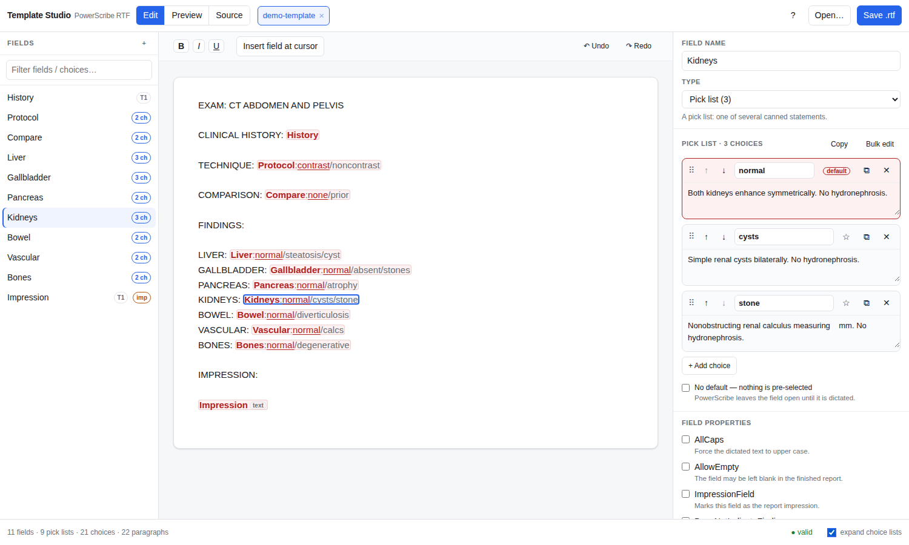
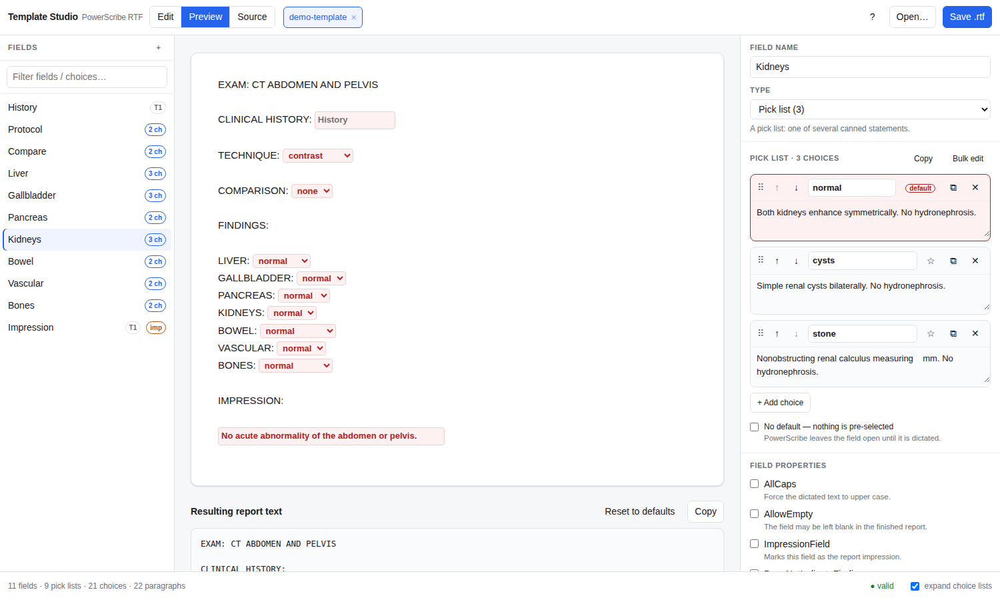

# PowerScribe Template Studio

A single-page browser app for viewing and editing **PowerScribe AutoText `.rtf` report
templates** — with a proper pick-list editor.

Everything runs in the browser. Templates are read with the File API and written back with a
local download; **no file is ever uploaded anywhere**, and the page makes no network requests
at all.



*Editing the included demo template, with choice lists expanded.*

## Why this exists

A PowerScribe AutoText `.rtf` is two things stitched together:

1. the report prose, as ordinary RTF; and
2. an XML block appended *after* the RTF's closing brace, which defines every field, its pick
   list, and — critically — its **character offset and length** in the plain text of the report.

```
...\cf2 Kidneys\cf1 :\cf2 normal\cf1 /cysts/stone\par
}
 {\xml}<?xml version="1.0" encoding="utf8"?><autotext version="2" editMode="2">
   <field type="3" start="265" length="26"><name>Kidneys</name>
     <defaultvalue>normal</defaultvalue>
     <choices><choice name="normal">Both kidneys enhance symmetrically. No hydronephrosis.</choice>...
```

Those offsets are why these files cannot safely be hand-edited: change one character of prose,
or one word of one pick-list label, and every field after it points at the wrong place. This
editor rebuilds the body and recomputes every offset and `textSource` range on save, and
refuses to write the file if anything fails to line up.

### The offset model

Offsets index the *plain text* of the report, where:

| RTF | counts as |
| --- | --- |
| `\par`, `\line` | 1 character (newline) |
| `\tab` | 1 character |
| `{\fonttbl…}`, `{\colortbl…}`, `{\*\generator…}` | 0 characters |
| literal text, `\'hh`, `\uN` | the character itself |

A field's range covers exactly `Name` for a text field, and `Name:label1/label2/…` for a pick
list. Each choice is shown by its **label** (`<choice name="…">`), or by its **statement text**
when the label is blank. `<textSource>` marks the field name and the default label — those are
the runs drawn in red (`\cf2`) in the body.

## Using it

Open `index.html` (or the hosted page), then drop one or more `.rtf` templates on it.
A synthetic template to try it on ships in [`test/samples/demo-template.rtf`](test/samples/demo-template.rtf).

- **Edit** — the report as PowerScribe renders it, fields as clickable chips. Toggle
  *expand choice lists* to see the full `Name:a/b/c` inline. Prose, headings, bold / italic /
  underline and paragraph structure are all editable; fields can be inserted or deleted anywhere.
- **Inspector** — add, duplicate, delete, reorder (drag or arrows) pick-list choices; edit label
  and statement separately; one click to set the default; *Bulk edit* takes a whole list as
  `label | statement` lines; *Copy* / *Paste* moves a list between fields or templates. Also
  field name, type, all custom properties, and voice synonyms.
- **Preview** — the finished report with every pick list as a live dropdown, plus the resulting
  plain text with a Copy button.

  
- **Source** — the exact RTF and XML that will be written, with an offset verification line.

`Ctrl`/`⌘`+`S` saves, `Ctrl`+`O` opens.

## Guarantees

On the three sample templates this was built against, an untouched template saves back with:

- the AutoText XML **byte-for-byte identical**,
- the report's plain text identical, and
- every field offset re-verified against the regenerated body.

## Hosting

`index.html` is fully self-contained — no build step, no dependencies, no CDN. To publish with
GitHub Pages: push this repo, then **Settings → Pages → Source: Deploy from a branch →
`main` / `/ (root)`**. The site appears at `https://<user>.github.io/<repo>/`.

## Development

```
node src/build.js      # inlines src/core.js + src/app.js into shell.html -> index.html
node test/roundtrip.js # runs against every .rtf in test/samples/
```

- `src/core.js` — RTF tokenizer, AutoText XML parser, document model, serializer, validator.
  No DOM dependency; runs in Node for tests.
- `src/app.js` — UI.
- `src/shell.html` — markup and styles, with `/*CORE*/` and `/*APP*/` placeholders.

`test/samples/` is gitignored apart from the synthetic `demo-template.rtf`. Drop your own
templates in there to test against them — they will not be committed. Do not commit real
department templates, and keep them out of screenshots and issue reports too: the body text of a
template is departmental content even though it contains no patient data.

## Disclaimer

Not affiliated with or endorsed by Nuance / Microsoft. PowerScribe is their trademark. Check any
edited template in PowerScribe before putting it into clinical use.

MIT licensed.
